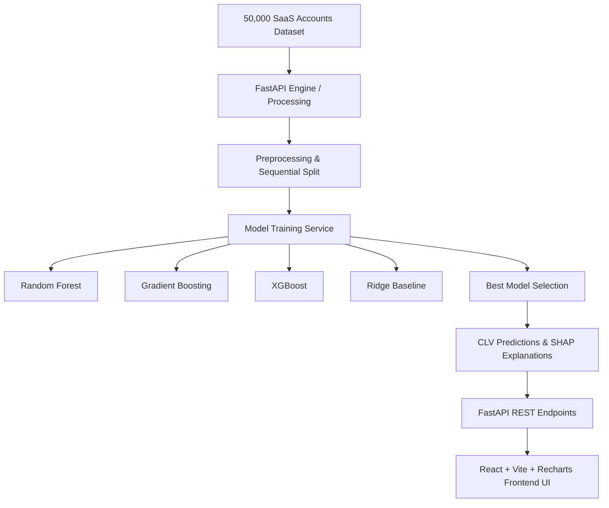

# Nexora AI — Customer Lifetime Value & XAI Platform

[](https://python.org)
[](https://fastapi.tiangolo.com)
[](https://reactjs.org)
[](https://vitejs.dev)
[](#)

**Nexora AI** is an explainable Customer Lifetime Value (CLV) prediction, intelligence, and decision support platform built specifically for B2B/SaaS business models.

---

## 🎯 Four Core Business Questions Answered

1. **What is each customer’s predicted future Customer Lifetime Value (CLV)?**  
   12-month future revenue prediction via supervised machine learning models trained on 50,000 real SaaS account records.

2. **Which historical financial, behavioral, usage, support, and customer attributes drive that prediction?**  
   Grounded local and global model explainability using **SHAP (SHapley Additive exPlanations)** TreeExplainer and LinearExplainer.

3. **Is the customer’s value increasing, stable, or declining?**  
   Percentile-based CLV segmentation, trajectory analysis (MRR trend), and composite customer health scoring.

4. **What action should the business take to increase value or protect high-value customers?**  
   Rule-driven retention playbooks and AI copilot recommendations grounded in real customer parameters.

---

## 🏗️ Technical Architecture & Product Hierarchy

### Product Hierarchy
- **Primary Objective**: 12-Month CLV Regression & Value Intelligence.
- **Secondary Capability**: Churn Risk Prediction (Support/Intervention Proxy).
- **Supporting Features**: Portfolio Revenue Forecasting (ETS), Cohort Analytics, SHAP Explainability, Gemini AI Copilot.



---

## 🚀 Quick Start & Installation

### Prerequisites
- **Python**: 3.10+
- **Node.js**: 18+ & npm/pnpm

### 1. Backend Setup (FastAPI)
```bash
cd nexora-backend
python -m venv venv
# On Windows:
.\venv\Scripts\activate
# On Linux/macOS:
source venv/bin/activate

pip install -r requirements.txt
python -m uvicorn app.main:app --reload --port 8000
```
Backend API interactive documentation will be available at: [http://localhost:8000/docs](http://localhost:8000/docs).

### 2. Frontend Setup (React + Vite)
```bash
cd "Nexora AI Platform Design"
npm install
npm run dev
```
Open your browser to: [http://localhost:5173](http://localhost:5173).

---

## 📊 Core API Endpoints

| Endpoint | Method | Description |
|---|---|---|
| `/api/auth/login` | `POST` | JWT authentication login |
| `/api/customers` | `GET` | Paginated customer list with filtering & sorting |
| `/api/customers/{id}` | `GET` | Individual Customer 360° profile |
| `/api/customers/{id}/shap` | `GET` | Local per-customer SHAP attribution values |
| `/api/clv/summary` | `GET` | Portfolio-wide CLV summary metrics |
| `/api/model/metrics` | `GET` | Evaluated candidate models & test set benchmarks |
| `/api/model/feature-importance` | `GET` | Global SHAP feature importances |
| `/api/model/retrain` | `POST` | Trigger background model training |
| `/api/churn/summary` | `GET` | Secondary churn risk summary |
| `/api/forecast/revenue` | `GET` | ETS 12-month portfolio revenue forecast |
| `/api/copilot/chat` | `POST` | Grounded AI Copilot assistant |
| `/api/export/csv` | `GET` | Streaming CSV export of customer dataset |

---

## 🔬 Academic & Technical Integrity

1. **No Data Leakage**: Future target variable `clv_target_12m_revenue_based` is strictly isolated during feature matrix assembly.
2. **True Test Evaluation**: All reported metrics ($R^2$, MAE, RMSE) are derived from a sequential held-out 20% test split.
3. **Additive SHAP Explainability**: Local base values and feature contributions satisfy the efficiency and symmetry axioms of Shapley values.
4. **Transparent Rules**: Derived metrics (segmentation, trajectories, health scores) use documented, deterministic formulas.

---

## 📄 License
Licensed under the MIT License.
